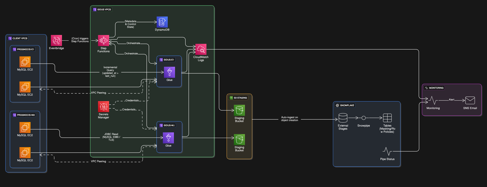

# DevOps Portfolio
## Multi-Region Data Pipeline Orchestration & Secret Management — AWS
Architecture diagram for a multi-region data pipeline using DynamoDB
orchestration, S3 staging, Snowflake ingestion, and AWS Secrets Manager
for credential automation across 200+ servers.
> Note: Implementation details are confidential. Diagram shared with
> client approval for portfolio purposes.

